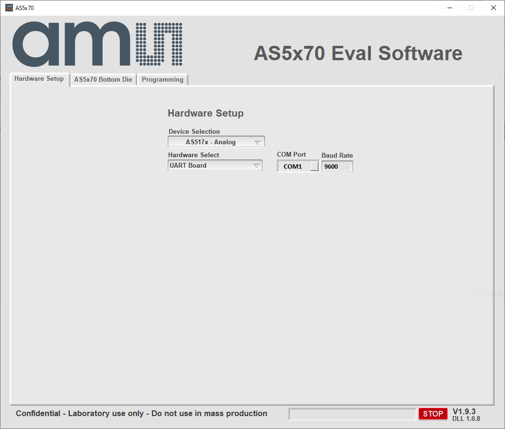

# Installtion.
1. Download and install NI labVIEW runtime 2020 32bit [here](https://www.ni.com/en/support/downloads/software-products/download.labview-runtime.html#show-offline-installers).
2. Download and install NI visa runtime 2020 [here](https://www.ni.com/en/support/downloads/drivers/download.ni-visa.html#show-offline-installers). You don't need to install any addtional items leave everything as default.
3. Download and install the FTDI driver from here [here](https://ftdichip.com/drivers/vcp-drivers/)
4. Finally download the evaluation software and unzip it [here](https://gittf.ams-osram.info/SSE_Premstaetten/MagneticPosSensors/Releases/AS5x7yEvalSW/-/archive/main/AS5x7yEvalSW-main.zip)

# How to use
1. Start with Hardware setup, select the used programmer "UART Board, SD4Yv01 or SD4Yv02"
2. select the correct com port.
3. For SD4Yv, click connect.

{width=75%}

4. Move to Devive tab, depend on the selected device on the HW tab, you may have two "for dual die devices".
5. Select the desired configurations as shown in the image below

{width=75%}

6. To know morw about the paramters and progamming steps, please read the [datasheet](https://ams-osram.com/search?productSearch=true&filter_products=position-sensors)

# Supported devices
1. [AS5070](https://ams-osram.com/products/sensors/position-sensors/ams-as5070-high-resolution-position-sensor)
2. [AS5270](https://ams-osram.com/products/sensors/position-sensors/ams-as5270-magnetic-angular-position-sensor)
3. [AS5171](https://ams-osram.com/products/sensors/position-sensors/ams-as5171-high-resolution-position-sensor)

# Supported programmers
1. [UART Board](https://ams-osram.com/products/boards-kits-accessories/boards/ams-as5xxx-evm-pb-usb-evaluation-board)
2. [SD4Yv01](https://look.ams-osram.com/m/8a485bb9cdb32bd7/original/AS5xxx_SD4Y_UG000435_1-00.pdf)
3. SD4Y02

# To avoid errors 
1. make sure you followed the installation steps
2. Check the programmer link and go to downloads section for user guide.
3. Once you have the user manual, check the wiring, supply voltages and jumper connection if needed.